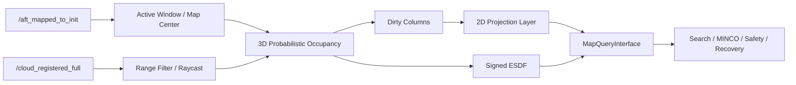

# 🗺️ ROGMap · Projection · ESDF

> 为高速局部规划定制的滚动占据地图：接收 Point-LIO 稠密点云，维护概率占据、语义投影层与有符号 ESDF，并向 MincoPlanner 提供低延迟进程内查询。

[返回项目主页](../../../README.md) · [Point-LIO](../Point-LIO/README.md) · [MINCO Planner](../../navigation/minco_planner/README.md)

## ✨ 模块定位

本仓库中的 ROGMap 不是独立地图节点：`MincoPlanner` 插件在配置阶段创建地图实例，并获取 `MapQueryInterface` 指针。地图仍通过 ROS 2 接收点云与里程计、发布可视化，但规划搜索、轨迹优化与安全检查可以直接查询内存中的地图状态。

主要能力：

- 以机器人为中心的三维滑动概率占据栅格。
- 基于 raycast 的 hit / miss 更新与可选时间衰减。
- 将三维观测投影为二维可通行性/地形层。
- dirty-column 增量维护，避免每周期全图重复投影。
- 有符号 ESDF，为 MINCO 障碍代价与安全检查提供距离和梯度。
- SensorData QoS `keep_last(1)` 接收最新稠密点云。
- 地图更新、投影、ESDF 与可视化频率可独立控制。

## 🧠 数据链路



## 🧱 地图层语义

| 层 | 作用 |
|---|---|
| Occupancy | 三维 free / occupied / unknown 概率状态 |
| Inflated Occupancy | 按机器人安全尺度膨胀后的障碍状态 |
| Projection Layer | 柱状投影得到的 free、passable、occupied、unknown 等二维语义 |
| ESDF | 到最近障碍的有符号距离及梯度 |
| Active Window | 随机器人移动的局部有效地图范围 |

投影层不是简单“取最高点”。它综合指定 Z 范围内的观测数量、表面高度变化、墙面/隧道判据、未知状态和迟滞保持，减少坡面、孔洞及稀疏回波导致的瞬时跳变。

## 📡 ROS 接口

### 输入

| Topic | 类型 | 说明 |
|---|---|---|
| `/cloud_registered_full` | `sensor_msgs/msg/PointCloud2` | `camera_init` 世界系稠密点云 |
| `/aft_mapped_to_init` | `nav_msgs/msg/Odometry` | 地图中心、传感器状态与超时判断 |

### 可视化输出

| Topic | 内容 |
|---|---|
| `/rog_map/occupied` | 占据点 |
| `/rog_map/occupied_raw` | 未膨胀占据点 |
| `/rog_map/unknown` | 未知体素 |
| `/rog_map/inflated` | 膨胀障碍 |
| `/rog_map/frontier` | 前沿区域 |
| `/rog_map/esdf` | ESDF 可视化 |
| `/rog_map/layer_value` | 动态与 PGM 静态先验融合后的二维障碍投影（**二值 mask**：100 = 障碍） |
| `/rog_map/layer_value_dynamic` | 仅在线三维感知生成的动态二维障碍投影 |
| `/rog_map/layer_value_static` | 仅 PGM 静态先验在当前 ROGMap 网格上的二维障碍投影 |
| `/rog_map/layer_type` | 四类投影结果，按 OccupancyGrid 数值编码：`-1`=UNKNOWN、`33`=FREE、`66`=PASSABLE、`100`=OCCUPIED；RViz Map 使用 `costmap` 配色显示四档 |
| `/rog_map/layer_confidence` | 分类置信度 |
| `/rog_map/layer_height_delta` | 柱内高度变化：每格一个点，**z = 该柱占据最高点，intensity = height_delta**，是判读分类分支最直接的一条 |
| `/rog_map/field` | 势场/距离场诊断 |
| `/rog_map/decay_cells` | 衰减单元诊断 |
| `/rog_map/map_bound` | 当前滑动地图边界 |

## ⚙️ 关键配置

参数位于 `src/mas2027_nav_executor/config/planner_params.yaml` 的 **`planner.rog_map`** 子树
（`path_planner.cpp:25` `config.loadFromRosNode(node_, "planner.rog_map")`）。安装目录里那份是该文件的
**软链**，改 src 即生效、不用重编；但 `Config::loadFromRosNode()` 只在 configure 时读一次，
**没有 on-set-parameters 回调**，所以改完必须重启节点 / 重新 launch。独立跑 `rog_map_node` 时前缀是
`rog_map.`（`rog_map_node.cpp:41`）。

下表**现值** = 本仓库当前 yaml，**默认** = `config.hpp` 内置默认；**yaml 里没有的项就是取默认**。

### 地图几何与滑动窗口

| 参数 | 现值 | 默认 | 说明 |
|---|---:|---:|---|
| `frame_id` | `odom` | `world` | 地图与可视化坐标系名（数据本身来自 LIO 的 `camera_init`/odom 系） |
| `resolution` | `0.05` | `0.1` | 体素边长（m）。投影的所有高度阈值只在它的整数倍上有意义 |
| `inflation_resolution` | `0.05` | `0.1` | 膨胀层分辨率 |
| `map_size` | `[10, 10, 2.5]` | `[10, 10, 0]` | 滑动窗口物理尺寸。**z 是容器上限**：局部地图边界 = 中心 ± `map_size/2`，`raycasting.local_update_box` 与 `visualization.range` 都会被夹进这个盒子 |
| `fix_map_origin` | `[0, 0, 0]` | `[0, 0, 0]` | 地图固定原点，也是 `robot_state_.p` 的初值（`prob_map.cpp:76`） |
| `map_sliding.enable` | `true` | `true` | 是否启用滑动窗口 |
| `map_sliding.threshold` | `0.2` | `-1` | 位移超过该值（m）触发滑窗 |
| `map_sliding.center_offset_enable` | 未设置 | `false` | 地图中心偏置开关 |
| `map_sliding.center_offset` | 未设置 | `[0,0,0]` | 地图中心相对 odom 参考点的偏移，按 yaw 旋转后叠加（`rog_map.cpp:308-315`）。它**不是雷达外参**，也不改点云坐标 |
| `virtual_ground_height` | `-1.5` | `-0.80` | 低于本值的体素一律 `isOccupied()==true`（`prob_map.cpp:156`）。**必须低于 `projection.scan_z_min_abs`**，否则投影窗口探到“地面以下”，每列凭空多出虚假占据、污染分类统计 |
| `virtual_ceil_height` | `3.0` | `1.80` | 高于本值同样一律判占据 |
| `inflation_step` | 未设置 | `1` | 三维膨胀核半径（体素）：1 → 3×3×3 |
| `unk_inflation_en` / `unk_inflation_step` | 未设置 | `false` / `1` | 未知区域是否单独膨胀 |
| `intensity_thresh` | 未设置 | `-1` | ≤0 不过滤；>0 时丢弃 `intensity <` 本值的点 |
| `point_filt_num` | 未设置 | `2` | 点云抽稀：每 N 个点只取 1 个（`prob_map.cpp:938`） |
| `frontier_extraction_en` | 未设置 | `false` | 前沿提取（`/rog_map/frontier`）开关 |
| `load_pcd_en` / `pcd_name` | 未设置 | `false` / `map.pcd` | 启动时把 PCD 当先验占据装入；`${CMAKE_ROOT_DIR}/` 前缀会被替换 |

### ROS 回调与可视化

| 参数 | 现值 | 默认 | 说明 |
|---|---:|---:|---|
| `ros_callback.enable` | `true` | `false` | 由地图自己创建订阅；嵌入 planner 时必须为 true |
| `ros_callback.cloud_topic` | `/cloud_registered` | `/cloud_registered_full` | 稠密点云话题 |
| `ros_callback.odom_topic` | `/Odometry` | `/lidar_slam/odom` | 里程计话题 |
| `ros_callback.odom_timeout` | `0.08` | `0.05` | 里程计过期保护（s） |
| `ros_callback.update_period_ms` | `20` | `1` | 地图更新周期（ms） |
| `visualization.enable` | `true` | `false` | 发布 `/rog_map/*` 全套可视化；**RViz/Foxglove 与任何现场探针的数据来源** |
| `visualization.frame_id` | `odom` | 空 → `frame_id` | 可视化坐标系 |
| `visualization.rate` | `5.0` | `5.0` | 发布定时器频率（Hz） |
| `visualization.range` | `[10, 10, 1.5]` | `[10, 10, 2.0]` | 发布范围，最终仍会被 `map_size/2` 夹住 |

### 概率更新与 raycast

| 参数 | 现值 | 默认 | 说明 |
|---|---:|---:|---|
| `raycasting.enable` | `true` | `true` | raycast 更新开关 |
| `raycasting.batch_update_size` | `1` | `1` | 累积 N 帧才做一次批量 raycast |
| `raycasting.ray_range` | `[0.3, 10.0]` | `[0.3, 10.0]` | 有效回波距离区间（m）。**下限必须盖住车体半径**，否则车身点云进图、原点净空≈0 |
| `raycasting.local_update_box` | `[10, 10, 2.0]` | `[999, 999, 999]` | 单帧允许更新的局部盒子（z 半高 ±1.0 m），最终被 `map_size/2` 夹住 |
| `raycasting.p_hit` / `p_miss` | `0.9` / `0.45` | `0.70` / `0.70` | 命中 / 穿越的概率增量（内部转对数几率） |
| `raycasting.p_occ` / `p_free` | `0.85` / `0.499` | `0.80` / `0.30` | 占据 / 自由判定阈值。`p_free` 越接近 0.5 越激进（更多格子被判 free） |
| `raycasting.p_min` / `p_max` | 未设置 | `0.12` / `0.97` | 概率上下界 |
| `raycasting.unk_thresh` | 未设置 | `0.70` | unknown 判定阈值 |
| `raycasting.parallel_enable` | `false` | `true` | 并行 raycast；别名 `performance.parallel_raycast_enable` |
| `raycasting.num_threads` | 未设置 | `4` | 并行线程数；别名 `performance.raycast_num_threads` |

判定口径（`prob_map.h:163-173`，内部存对数几率）：`free` = `< l_free`，`occupied` = `>= l_occ`，其余为 `unknown`。

### 衰减

| 参数 | 现值 | 默认 | 说明 |
|---|---:|---:|---|
| `decay.enable` | `true` | `true` | 时间衰减开关 |
| `decay.keep_time` | `0.8` | `0.4` | 命中后保持占据的时间（s） |
| `decay.clear_time` | `1.2` | `0.0` | 之后回到 free 的时间（s）。**校验：`clear_time > keep_time`，否则启动即抛异常** |
| `decay.active_list_enable` | 未设置 | `true` | `true` = 只遍历活跃表（快）；`false` = 全图扫描 |

衰减不能替代可靠的空闲观测：动态残影要连同点云时序、miss ray 与 active window 一起看。

### 二维投影（决定 `/rog_map/layer_value`）

| 参数 | 现值 | 默认 | 说明 |
|---|---:|---:|---|
| `projection.enable` | `true` | `true` | 投影层总开关 |
| `projection.scan_z_min_abs` | `-1.2` | `-0.25` | 投影 z 窗口下限 |
| `projection.scan_z_max_abs` | `2.75` | `1.50` | 投影 z 窗口上限 |
| `projection.scan_z_relative_to_robot` | `true` | `false` | true 时上两项是相对 `/Odometry` z 的偏移，LIO z 漂移不会把车身高度的障碍裁出窗口 |
| `projection.unknown_as_occupied` | `false` | `true` | UNKNOWN 是否算二维障碍。**必须与 `planner.exploration.unknown_as_occupied` 一致**，否则全局搜索与距离场对同一格给出相反结论 |
| `projection.min_observed_voxels` | `1` | `2` | 柱内至少几个已观测（free/occ）体素才算“观测过” |
| `projection.surface_height_delta_max` | `0.15` | `0.10` | span ≤ 本值 → PASSABLE（薄面：地面、坡面、桌面）。**2026-09-22 由 0.10 放宽到 0.15**（桌子被判障碍），代价见下方⚠️ |
| `projection.wall_height_delta_min` | `0.8` | `0.20` | span ≥ 本值且竖直占据率 ≥ `wall_occupancy_ratio_min` → OCCUPIED（实心墙） |
| `projection.wall_occupancy_ratio_min` | `0.9` | `0.80` | 墙面的竖直占据率下限 |
| `projection.tunnel_height_delta_min` | `0.25` | `0.24` | 中空结构 span 下限 |
| `projection.tunnel_height_delta_max` | `0.4` | `0.40` | 中空结构 span 上限 |
| `projection.tunnel_occupancy_ratio_max` | `0.45` | `0.55` | 中空结构的竖直占据率上限。**校验：必须 < `wall_occupancy_ratio_min`** |
| `projection.passable_cost` | 未设置 | `50` | PASSABLE 格的 value。**只有 `passable_as_free: false` 时才出现在图里**；安全检查只拒 254，所以它不会让规划器绕开这些格子 |
| `projection.passable_as_free` | `true` | `true` | PASSABLE 的 **mask 恒为 1（自由）**，本项只决定 value 是 0 还是 `passable_cost` |
| `projection.hysteresis_enable` | `false` | `true` | 分类迟滞：OCCUPIED 立即进入，清出需连续确认 |
| `projection.hysteresis_count` | 未设置 | `2` | 迟滞确认次数 |
| `projection.obstacle_hold_time` | `1.5` | `0.0` | 曾判占据的格子强制保持占用的时间（s） |
| `projection.mask_filter_en` | `true` | `true` | 二维 8 邻域补洞 + 孤立障碍去噪 |
| `projection.fill_occ_min` | `8` | `5` | 周围 ≥N 个占据邻居的自由格填成障碍。**合法区间 [1,8]，≥9 直接抛异常、节点起不来** |
| `projection.denoise_occ_max` | `0` | `0` | 占据邻居 ≤N 的孤立障碍判 UNKNOWN。**校验 `< fill_occ_min`** |
| `projection.prior_map.enable` | `false` | `false` | 静态先验融合（`/rog_map/layer_value_static`）。开启时 `yaml_path` 必填且 `frame_id` 不得为空 |
| `projection.prior_map.yaml_path` | `…/map/lab3.yaml` | 空 | Nav2 风格地图 YAML |
| `projection.prior_map.pgm_path` | 空 | 空 | 留空时用 YAML 的 `image` 字段，并相对 YAML 所在目录解析 |
| `projection.prior_map.frame_id` | `map` | `map` | 先验图坐标系 |

**分类只看一个数**：柱内占据体素的 z 跨度 `span = (最高占据层号 − 最低占据层号) × resolution`
（`projection_layer.cpp:17-79`）：

| span | 附加条件 | 结果 |
|---|---|---|
| `≤ surface_height_delta_max` | — | **PASSABLE**（薄面） |
| `≥ wall_height_delta_min` | 竖直占据率 ≥ `wall_occupancy_ratio_min` | OCCUPIED（实心墙） |
| 落在 `[tunnel_min, tunnel_max]` | 竖直占据率 ≤ `tunnel_occupancy_ratio_max` | **PASSABLE**（中空/夹层） |
| 其余（含 `surface < span < tunnel_min` 的死区） | — | OCCUPIED（AMBIGUOUS） |

派生约束（`config.hpp:313-346`，违反即启动失败）：
`surface_height_delta_max < tunnel_height_delta_min`、`surface_height_delta_max < wall_height_delta_min`、
`tunnel_height_delta_min ≤ tunnel_height_delta_max`、`tunnel_occupancy_ratio_max < wall_occupancy_ratio_min`。

⚠️ **薄面这条判据是双刃剑**：它让地面、坡面和桌面这类“薄板”可通行，但墙面在掠射角下只被打出一条
很薄的竖直切片时也会落进这一档 → 墙在 ROGMap 里“消失”，规划器穿墙后被执行器急停（2026-09-16 现场
已复现，见 `src/docs/change-history.md`）。要放宽 `surface_height_delta_max` 前，先看
`/rog_map/layer_height_delta` 的实际读数，并对比 CSV 的 `reason_thin_surface` 与
`reason_ambiguous_occupied` 两列。

### 二维距离场（喂规划器的 ESDF）

| 参数 | 现值 | 默认 | 说明 |
|---|---:|---:|---|
| `field.enable` | `true` | `true` | 二维距离场开关 |
| `field.inflation_radius` | `0.0` | `0.33` | 已在距离场里扣除的膨胀半径；安全检查会在此基础上再加自己的余量 |
| `field.max_distance` | `6.0` | `3.0` | 距离上限（m） |
| `field.min_distance` | `-3.0` | `-1.0` | 距离下限，必须 ≤ 0 |
| `field.clamp_distance` | 未设置 | `true` | 是否把距离夹到 `[min, max]` |
| `field.interpolation` | `quadratic` | `bilinear` | 插值方式；quadratic 在边界/邻域不足时回退 bilinear |
| `field.update_rate` | `20.0` | `20.0` | 距离场更新频率（Hz）；别名 `performance.field_update_rate` |

### 三维 ESDF（可选）

| 参数 | 现值 | 默认 | 说明 |
|---|---:|---:|---|
| `esdf.enable` | 未设置 | `false` | 三维有符号距离场。规划器查询的是二维 `field`，本项只影响 `/rog_map/esdf` 与 decay 后的三维场更新 |
| `esdf.resolution` | 未设置 | `0.2` | 三维 ESDF 分辨率 |
| `esdf.local_update_box` | 未设置 | `[10, 10, 2.0]` | 三维 ESDF 更新范围 |

### 性能与诊断 CSV

| 参数 | 现值 | 默认 | 说明 |
|---|---:|---:|---|
| `performance.enable` | `true` | `true` | 性能统计总开关 |
| `performance.summary_csv_enable` | `true` | `false` | 每秒一行的汇总 CSV |
| `performance.summary_csv_path` | `.scratch/rog_map_perf_summary.csv` | `/tmp/rog_map_perf_summary.csv` | **必须落在工作区内**：写 `/tmp` 时排障侧读不到 |
| `performance.summary_rate` | `1.0` | `1.0` | 汇总频率（Hz） |
| `performance.detailed_csv_enable` | `true` | `false` | **每次更新一行，开销大**；只在需要逐帧时序时打开，诊断完应关回 false |
| `performance.detailed_csv_path` | 未设置 | `/tmp/rog_map_perf_detailed.csv` | 明细 CSV 路径 |
| `performance.print_enable` | `false` | `false` | 打到 stdout（不进 ROS 日志文件） |
| `performance.dirty_column_enable` | `true` | `false` | 脏列增量投影（false = 每帧全量重投影整张二维窗口） |
| `performance.dirty_full_ratio` | `0.95` | `0.30` | 脏列比例超过它就回退全量。稠密点云下脏列常年 ~49%，阈值太低会让增量路径永不生效 |
| `performance.dirty_full_period_s` | `0.5` | `0.0` | 周期性全量兜底（s），0 = 关闭 |
| `performance.run_id` / `scenario` / `variant` | 未设置 | 空 | CSV 里的标注字段 |
| `performance.csv_flush_every_n` | 未设置 | `30` | 每 N 行刷盘一次 |

关键列：`cloud_callback_hz`（输入点云频率）、`map_update_hz`（实际更新频率，明显低于输入即积压）、
`last_total_update_time_ms` / `last_projection_time_ms` / `last_raycast_time_ms` / `last_field_time_ms`
（分阶段耗时），以及分类归因列 `reason_thin_surface` / `reason_solid_vertical_wall` /
`reason_hollow_tunnel` / `reason_ambiguous_occupied` / `reason_empty_column` —— 用来定位某一类结构
被判成了哪一档。

### 已接线但无效的参数

`debug.layer_pub_enable`、`debug.field_pub_enable`、`debug.pub_rate` 会被 `config.hpp:417-419` 读入，
但全仓库没有任何代码使用它们（grep 命中 0）——改了不会有任何效果。

### 📏 投影高度与雷达安装高度

当前投影窗口（`scan_z_relative_to_robot: true`）：

```yaml
projection:
  scan_z_min_abs: -1.2
  scan_z_max_abs: 2.75
```

这两个值是**相对 `/Odometry` z 的偏移**。若初始姿态近似水平，可按下式理解：

```text
相对雷达 Z = 障碍物世界高度 - 雷达安装高度
```

因此雷达装得越高，地面对应的相对 Z 越负。参数调整建议：

1. 测量雷达光心到底盘接触地面的高度 `h_lidar`。
2. 在静止点云中确认地面峰值是否约为 `-h_lidar`。
3. `z_min` 应排除大部分地面噪声，但保留需要识别的坡面/台阶结构；它必须高于 `virtual_ground_height`。
4. `z_max` 应覆盖对车体有碰撞意义的障碍高度。**车高以上的结构同样会参与统计**（桌面、椅背、货架
   下沿都算），这正是“桌子被判成障碍”这类问题的来源。
5. 同时检查 `map_size.z`：投影跨度可能大于局部 Z 尺寸，越界层会被裁掉，不意味着超出地图的高度仍被观测。

不要仅凭“地图障碍少”放宽 Z 范围；先确认 Point-LIO frame、雷达高度和车体俯仰/横滚补偿。

## 🚀 启动与检查

ROGMap 由 planner 生命周期节点创建。同一个进程里有**两个节点**，别认错：

| 节点 | 谁 | 持有哪些参数 |
|---|---|---|
| `/nav_executor` | `NavExecutorNode`（`nav_executor_node.cpp:56`） | `node.*`（如 `node.rog_map_clearance`） |
| `/nav_executor_planner` | `PathPlanner` 里的 `LifecycleNode`（`path_planner.cpp:20`） | **`planner.*` 与 `planner.rog_map.*`（本文档全部参数都在这里）** |

参数是在 `PathPlanner` **构造函数**里声明的（`path_planner.cpp:25` `config.loadFromRosNode(node_, "planner.rog_map")`），
所以进程一起来就能查，不必等生命周期 configure/activate。

```bash
ros2 node list                                            # 应看到 /nav_executor 与 /nav_executor_planner
ros2 topic hz /cloud_registered
ros2 topic hz /rog_map/occupied
ros2 topic echo /rog_map/map_bound --once

# 查参数：必须带上 planner.rog_map. 前缀，节点用 /nav_executor_planner
ros2 param list /nav_executor_planner | grep 'planner.rog_map.projection'
ros2 param get /nav_executor_planner planner.rog_map.projection.surface_height_delta_max
ros2 param dump /nav_executor_planner | grep -A40 rog_map      # 一次看全组
```

`ros2 param get` 读到的是**本次启动时节点拿到的值**。注意 ROGMap **没有 on-set-parameters 回调**，
所以 `ros2 param set` 会返回成功但地图行为不变——改 yaml 后必须重启节点，再用上面的命令确认。

怎么确认"确实生效了"（值 → 行为两条都要过）：

1. 启动日志出现 `[ROGMap Config] loaded prefix='planner.rog_map', ...`（`config.hpp:501`），
   没有这行说明节点根本没配起来（多半是参数校验抛异常）。
2. 行为侧按参数看对应证据：分类阈值看 `/rog_map/layer_type` 的翻转与 CSV 的
   `reason_thin_surface` / `reason_hollow_tunnel` / `reason_ambiguous_occupied`；
   `scan_z_*` 看 CSV `projection_z_layers`；`update_period_ms` 看 CSV 同名列；
   `dirty_column_enable` 看 `dirty_column_enabled` 与 `full_reason_*`；
   `visualization.rate` 看 `ros2 topic hz /rog_map/layer_type`；`field.max_distance` 看 `/rog_map/field`
   的 intensity 上限；`decay.clear_time` 看 `/rog_map/decay_cells` 的 intensity 上限。

RViz 调试建议依次打开原始点云、`occupied_raw`、`inflated`、`layer_type`、`layer_height_delta`
和 `field`，避免只看最终轨迹反推地图问题。

## 🛠️ 常见问题

| 现象 | 优先检查 |
|---|---|
| 地图完全为空 | 点云 topic/frame、QoS、odom 超时、raycast 距离 |
| 地图随机器人漂移 | Point-LIO 外参/去畸变、点云是否已在 `camera_init` |
| 地面被判为障碍 | 雷达高度、`projection.scan_z_min_abs`、`virtual_ground_height`、姿态与地面噪声 |
| 高处障碍消失 | `projection.scan_z_max_abs`、`map_size.z` 和局部地图中心 Z |
| 桌子/门楣等“上方有面、下方能过”的结构被判障碍 | 见上文分类表与 `projection.surface_height_delta_max`。先在 RViz 看 `/rog_map/layer_height_delta` 的 intensity（= 柱内 span），再决定是抬阈值（有“真墙变可通行”风险）还是改判据；`.scratch/table_probe.py` 是为此写的一次性探针 |
| 真墙在 ROGMap 里“消失”、规划器穿墙 | 掠射角薄竖直切片落进了 `surface_height_delta_max` 档；看 `layer_type` 与 CSV 的 `reason_thin_surface` |
| 动态障碍残留 | 点云时序、miss ray、`decay.*` 开关与保持时间 |
| 建图频率跟不上点云 | `performance.dirty_column_enable` / `dirty_full_ratio` / `dirty_full_period_s`，对比 CSV 的 `cloud_callback_hz` vs `map_update_hz` |
| ESDF 与占据层不一致 | `field.update_rate`、dirty 更新和膨胀参数 |
| 规划器报告查询不可用 | ROGMap 是否由插件成功创建、生命周期与 registry 状态 |
| 节点启动即死、日志为空 | 参数校验抛异常：`fill_occ_min ≥ 9`、`denoise_occ_max ≥ fill_occ_min`、`decay.clear_time ≤ keep_time`、`surface_height_delta_max ≥ tunnel_height_delta_min / wall_height_delta_min` |

## 🗂️ 关键源码

- `src/rog_map/rog_map.cpp`：地图配置、点云/里程计回调与更新入口、二维投影的列扫描器。
- `include/rog_map/rog_map_core/config.hpp`：**所有参数的名称、默认值与启动校验（唯一权威）**。
- `src/rog_map/projection_layer.cpp`：二维投影分类（`classifyCell()`）与增量更新。
- `src/rog_map/field_layer.cpp` / `esdf_map.cpp`：二维距离场与三维 ESDF。
- `src/rog_map/prior_map.cpp`：PGM 静态先验融合。
- `src/rog_map/query_adapter.cpp`：向规划器暴露的二维 ESDF / 代价查询。
- `include/rog_map_ros/rog_map_ros2.hpp`：ROS 2 回调、QoS、timer、可视化快照与接口实现。
- `src/rog_map_ros/rog_map_ros1.cpp`：当前构建使用的 ROS 2 接口编译入口（文件名为历史沿用）。
- `src/rog_map/rog_map_visualizer.cpp`：地图可视化。
- `src/navigation/minco_planner/src/minco_core/minco_planner.cpp`：插件内创建与共享方式。

## 📚 延伸阅读

上游点云性能链路见 [Point-LIO](../Point-LIO/README.md)，地图查询如何进入搜索、优化与恢复见 [MincoPlanner](../../navigation/minco_planner/README.md)。
